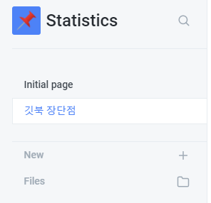

# 깃북 장단점

## 단점

* 글을 쓰다가 보면 자꾸 끊긴다. \(한글 문제인듯 하다. 영어로 쓰는 경우 문제가 없음\)
* 그래서 타자를 빠르게 칠 수가 없다. 

## 장점

* md 로 바로바로 수정이 된다. 
* Commit 과정이 귀찮지가 않다. 

* 사진 붙여넣기가 매우 편리하다.
* 자동 저장이 되어서 데이터가 날라가지 않는다. 
* 제목 수준을 변경할때마다, 가로선이 그어져서 구분하기 쉽다.

## 결론

* 하지만 계속되는 한글 입력 에러로 인해서 쓰기가 여간 힘든게 아니다. 이것만 고쳐지면 어느정도 쓸 수 있겠지만.. 일단은 깃허브 블로그나 쓰는것으로.

